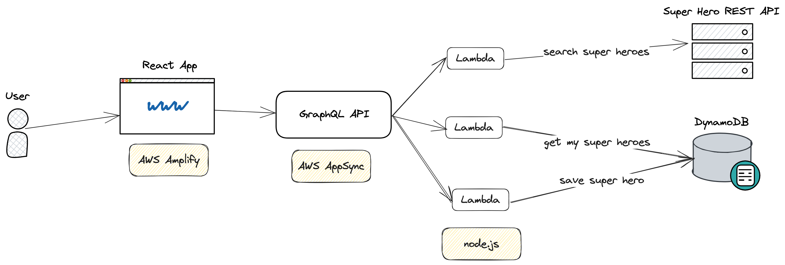

This is a simple application built for a superhero enthusiast, that can perform the following functions:

1. Allow a user to search for their favourite superhero.

2. Select the superhero, see their image, and power stats.

3. Edit the power stats

4. Save the image and stats to be viewed later.

So, essentially, the app would allow a user to search superheroes by name, see their details, edit them and view all their saved superheroes.

## Tech Stack

The application utilize the following tech stacks:

- Amplify
- AppSync (GraphQL)
- DynamoDB
- Lambda
- node.js (18.x)
- JavaScript

## Architecture



## Development

**Run the tests:**

```bash
auto/test
```

**Run the application locally:**

```bash
auto/local_run
```

Then you should be able to access the application: `http://localhost:3000/`.

**Deploy local changes to AWS:**

> You may need to [configure Amplify](https://docs.amplify.aws/cli/start/install/#option-2-follow-the-instructions) first.

```bash
auto/publish
```

## TroubleShooting

[Trouble Shooting](./docs/troubleshooting.md)

## Todo

Although I've try my best during the day, but there are still plenty of tasks/optimizations for the application:

- user sign up/login: integrate authentication/authorization with Cognito
- fix the lost focus of Input component when searching or updating super heros
- style the application so that they're better organized
- dockerize the application
